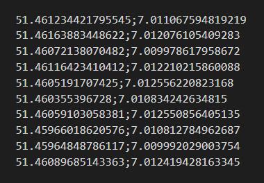

# Routing Optimization Example 

This project shows you how to you build a Routing Optimization Application with our MapTrip MapAPI. 

## Requirements

To build a Application like this you need to integrate our MapAPI in your Website.

For the Optimization you need to use the following request.

## Supported Formats

For Uploading a CSV file it must have the following format (LAT;LONG)

Here is an example of the right format:

