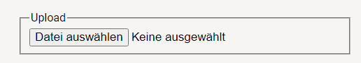

# How To Optimize And Navigate 200 Stops

A customer had 200 stops which he needs to visit in one tour. Here is what we suggested to meet the challenge. First, the stops need to be put in the optimal order to minimize drive time and distance. Then a FollowMe navigation file is created which contains an event at each location. This can then be uploaded to the FollowMe Editor and synchronized with MapTrip for navigation

## Preparations

This is what you need to do to use our MapAPI:

The easiest way is to include the core.js, which contains the mapping parts themself, base classes and interfaces.

just insert this 

into your page and start using the API. This will load the core API, the modules vectortiles , graphics , routing and controls.

## Upload Locations, Show On Map, Calculate Route

Upload Locations: 

First off all you need a CSV file with Coordinates that you can uploaded. 

After the csv is uploaded the function loadTextFile will be called. 

The Function saves the Coordinates and checks them according to the following criteria:

=> If the csv file have more than 200 Coordinates , then dives an error message.

=> If the Coordinates are longer than 200 Km from each other , then dives an error message

After the csv file has been checked , two functions are called.

The First Function that will be called is showMarker. Markers are created from the coordinates and are displayed on the map. Every Marker have a Number that a orderd by the csv file. In addition to the map, the list of the Coordinates are also displayed.

The Second Function that will be called is showRoute. This function calculate a Route through all stops.

## Optimize Stop Sequence

Next, you can perform a optimization. if you click on the Optimise button , then a loading bar appears until the optimised sequence has been successfully created. The new order of the Markers will be displayed on the map and a route will be calculated. All this is done by the function OptimizeRouting.

All you have to do is to pass an array with the Coordinates and the map as a parameter to the function. 
The first step is to create new IWCoordinate from the coordinates.

Here you must note that the coordinates should have the projection type Mercator.
The coordinates are saved into a new array and inserted at the following interface.

The url refers to our Optimizer and creates an optimal sequence from the coordinates.

With the result we get the array with the optimal order and create new IWCoordinates with the projection type WGS84. These are then saved in an array. Now you can pass the array to the functions showMarker and showRoute. They show the new order of the markers on the map and the new calculated route.

## Create FollowMe-Track From Route File

## Upload To FollowMe Editor And Sync To MapTrip