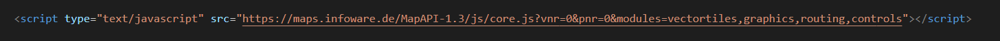
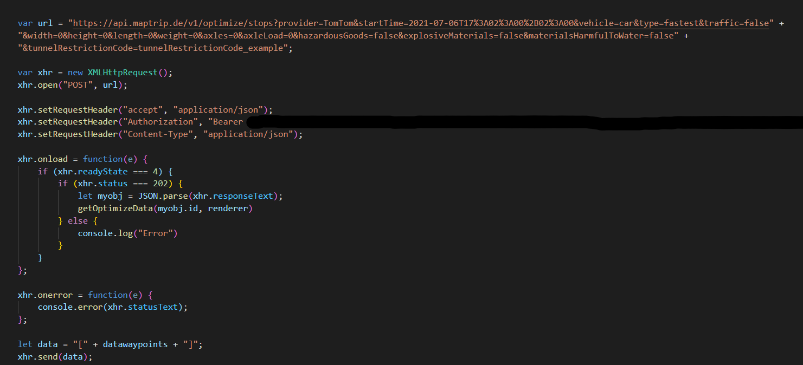
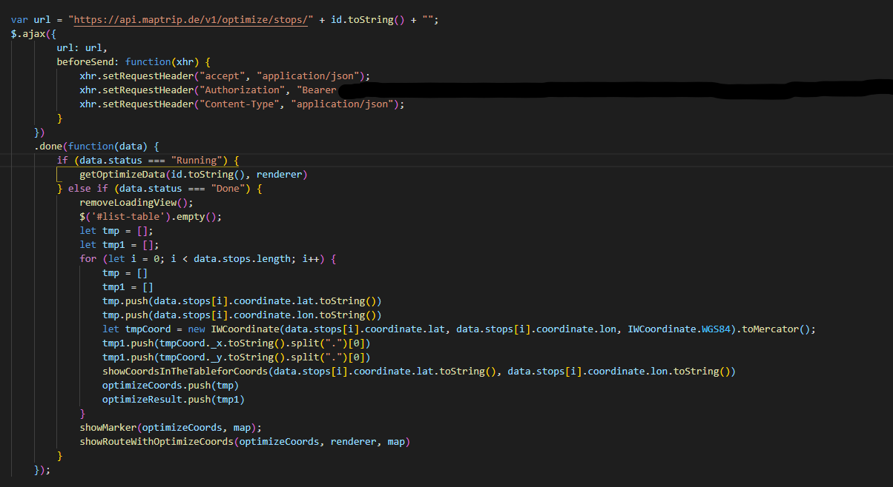
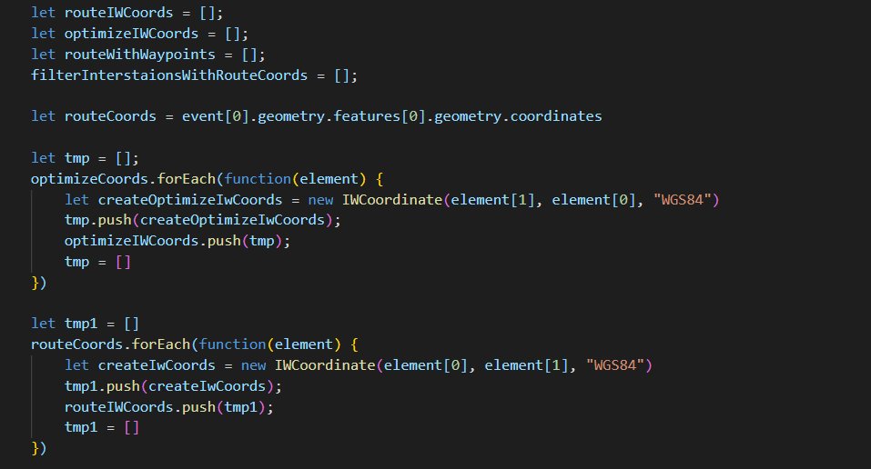
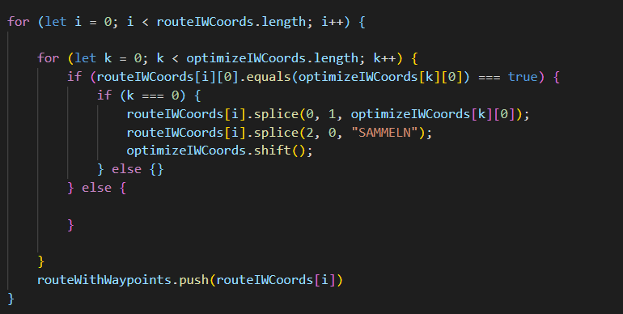
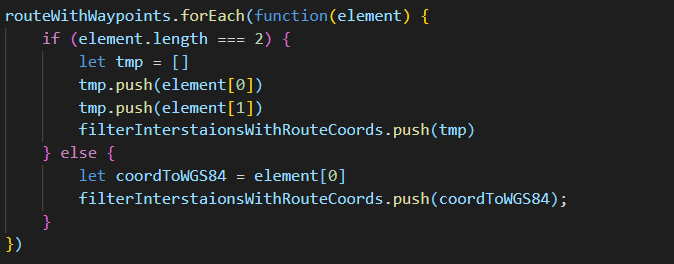

# How To Optimize And Navigate 200 Stops

A customer had 200 stops which he needs to visit in one tour. Here is what we suggested to meet the challenge. First, the stops need to be put in the optimal order to minimize drive time and distance. Then a FollowMe navigation file is created which contains an event at each location. This can then be uploaded to the FollowMe Editor and synchronized with MapTrip for navigation

## Preparations

This is what you need to do to use our MapAPI:

The easiest way is to include the core.js, which contains the mapping parts themself, base classes and interfaces.

just insert this 

into your page and start using the API. This will load the core API, the modules vectortiles , graphics , routing and controls.

Also you need the FileAPI.min.js from https://github.com/mailru/FileAPI. The File is already included in the project.

The routing and optimisation sequence was implemented using the MapTrip Server API.

On our web pages there is a common entry point for a detailed description of the interfaces: https://api.maptrip.de/swagger-ui.html

To use the Maptrip Server API you need a web token for the authentication, because is required to use the API interface functions.

The user accounts are managed in MapTrip Manager. If you do not have an account yet, please contact our sales department via eMail : info@infoware.de. In the following we assume that you have a valid username and password.

The token in the requests is specified in the form "Authorization: Bearer [token]".

## Upload Locations (Coordinates or Addresses), Show On Map, Calculate Route

Upload Locations:

First off all you need a CSV file with Coordinates that you can uploaded. 

After the file is uploaded the function openDataFromFile will be called. The function checks which type file you have choiced and what kind of Data you uploaded.

You can choice which file type you want to upload. You have two Options.

1. CSV File
2. Text File

When you have chosen between the two options, you can choose whether you want to upload addresses or coordinates.

Coordinates:

When you uploading coordinates, make sure that the formatting is valid. In each line belong latitude and longtitude. 
You must always separate them with a semicolon.
Here is an example 

Addresses:

When you uploading Addresses, make sure that the formatting is valid. In each line belong Street , Housenumber, Zipcode and City. 
You must always separate them with a semicolon.
Here is an example 

If you choice to upload Coordinates , the function saves the Coordinates and checks them according to the following criteria:

=> If the csv file have more than 200 Coordinates , then dives an error message.

=> If the Coordinates are longer than 200 Km from each other , then dives an error message

After the file has been checked , two functions are called.

If you choice to upload Addresses, they are first geocoded and then checked for the same criteria as for coordinates.

For the Adresses the function createObjectAndCheckForEachLine will be called. The function create for each Addresses in the file a new Object that be saved in a array. 
The function also checks if there are errors in the file.

Then we called Asynchronous function processArray. This function gecoding each Addresses.

You need to initialize the geocoder client.

Here we instantiate the IWGeocoderClient class and add a listener to the IWEventManager object. Listen for geocoding event 'ongeocode' and call the AddressToCoords(event, map) method when the event is triggered.

The function gets the result back and stores the coordinates in an array.

After this has been completed, the following criteria are checked, as with the coordinates.

=> If the csv file have more than 200 Coordinates , then dives an error message.

=> If the Coordinates are longer than 200 Km from each other , then dives an error message

After the file has been checked , two functions are called.

The First Function that will be called is showMarker. Markers are created from the coordinates and are displayed on the map. Every Marker have a Number that a orderd by the csv file. In addition to the map, the list of the Coordinates are also displayed.

The Second Function that will be called is showRoute. This function calculate a Route through all stops.

## Optimize Stop Sequence

Next, you can perform a optimization. if you click on the Optimise button , then a loading bar appears until the optimised sequence has been successfully created. The new order of the Markers will be displayed on the map and a route will be calculated. All this is done by the function getRoutingOptimization.

All you have to do is to pass an array with the Coordinates ,the map as a parameter and the renderer to the function. In the first step, the stops and other relevant information (vehicle properties, etc.) are transmitted to the server via POST request. The response to this initial request contains an ID that is used in the second step, the subsequent GET request, is used to request the calculated route.

The first step is to send the post request with data

If the Request is done you get as a response a ID. Which you to need save them and continue with a GET Request to get the Optimize order. After that you can push the optimize order to a array.

Now you can pass the array to the functions showMarker and showRoute. They show the new order of the markers on the map and the new calculated route.

## Create FollowMe-Track From Route File

Now you can make a FollowMe track out of it. Here you have to call the function exportAllCoordinates. You need to pass the array (optimizeCoords) and the route data as a parameter to the function. With the object you get the route file with all coordinates. We have to format the coordinates for the later course.

Here we need to check which of the coordinates is a stop.

After that we sorted the array.

This is what our array currently looks like

Now we want to use the function getRouteCoordsWith30mDistance to make sure that our coordinates are all 30m apart. For this we pass the array above to the function.

we push our stops in a seperate Array. 

The first coordinate is always a stop, which we can push and delete from the separate array.

Here we call our loop . We Call moveAlongPath which will return the Coordinates with the next point on the path. If the moveAlongPath returned null, so there are no more check points.

The last thing we do is push the first coordinate separately.  

We have our final array that we still need to format with the function exportToCsVFile 

and pass them to the download button

## Upload To FollowMe Editor And Sync To MapTrip
