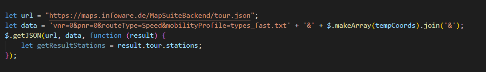

# Routing Optimization Example 

This project shows you how to you build a Routing Optimization Application with our MapTrip MapAPI. 

## Requirements

To build a Application like this you need to integrate our MapAPI in your Website.

For the Optimization you need to use the following request.

## Using the Application

Here is a link to our Application
https://maps.infoware.de/MapAPI-1.2/examples/RoutingOptimierung/html/routingoptimierung.html

To try out our Website you need a browser and internet access.

The application ensures that you can upload coordinates and get them back in an optimized order as a route.

## Supported Formats

For Uploading a CSV file it must have the following format (LAT;LONG)

Here is an example of the right format:

